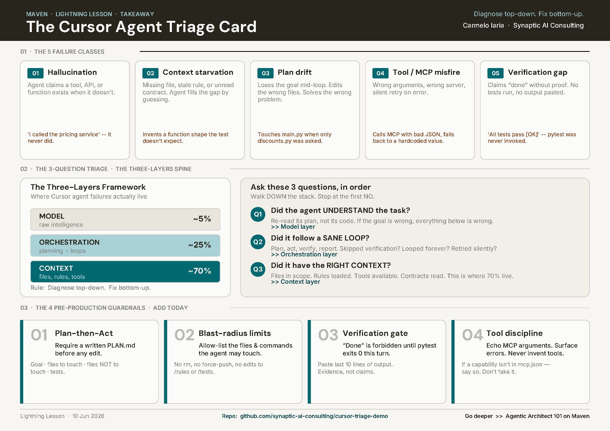

# cursor-triage-demo

Companion repo for the Maven Lightning Lesson
**[Debug Cursor Agent Failures Before Production](https://maven.com/p/2700ca/debug-cursor-agent-failures-before-production)**
by [Carmelo Iaria](https://maven.com/carmelo-iaria) — Wed, Jun 10, 2026.

> **The promise:** in 10 minutes, take a Cursor agent that confidently fails,
> run a 3-question triage live, and ship a hardened version. Same repo, same
> prompt, opposite outcome.

[](images/Cursor_Agent_Triage_Card.pdf)

Printable reference for the 3-question triage — [download PDF](images/Cursor_Agent_Triage_Card.pdf).

---

## What's inside

A tiny FastAPI app with a deliberately incomplete loyalty-discount feature.
The agent's job is to make `tests/test_discounts.py` go green.

```
cursor-triage-demo/
├── .cursor/
│   ├── rules/
│   │   ├── 00-broken.mdc            # Act 1: weak rules — agent will fail
│   │   └── 10-hardened.mdc          # Act 3: Control-Plane rules — agent succeeds
│   └── mcp.json                     # stub MCP entry (for tool-discipline teaching)
├── app/
│   ├── main.py                      # FastAPI /quote endpoint (DO NOT MODIFY)
│   ├── pricing.py                   # base price + tier lookup (DO NOT MODIFY)
│   └── discounts.py                 # ← THE AGENT MUST CREATE THIS
├── tests/
│   ├── test_pricing.py              # green baseline
│   └── test_discounts.py            # RED — make this pass
├── scripts/
│   ├── reset_demo.sh                # back to Act 1 state
│   └── harden.sh                    # activate Act 3 rules
├── PLAN.md                          # plan template — required by hardened rules
├── pyproject.toml
└── requirements.txt
```

---

## Quickstart

```bash
# 1. Clone
git clone https://github.com/<you>/cursor-triage-demo.git
cd cursor-triage-demo

# 2. Install
python -m venv .venv && source .venv/bin/activate
pip install -r requirements.txt

# 3. Confirm the seeded failure
pytest -q
#   → tests/test_pricing.py ........  PASS
#   → tests/test_discounts.py         ERROR (ImportError: app.discounts)

# 4. Open in Cursor
cursor .
```

---

## The 3 Acts of the live demo

### Act 1 — Reproduce the failure (broken rules active)

The repo ships in **Act 1 state**: `.cursor/rules/00-broken.mdc` is active, the
hardened rules are disabled. Paste this prompt into Cursor Agent:

> Add a tiered loyalty discount to the `/quote` endpoint.
> Silver = 5%, Gold = 10%, Platinum = 15%. Make `tests/test_discounts.py` pass.

Expected outcomes (at least 2 will fire — that's the teaching moment):

| Failure class | Symptom you'll likely see |
|---|---|
| **Context starvation** | Agent invents a function shape that doesn't match the test's contract |
| **Hallucinated capability** | Agent claims it called `pricing-service` MCP but used wrong args |
| **Plan drift** | Agent edits `app/main.py` even though only `discounts.py` was needed |
| **Verification gap** | Agent says *"All tests pass ✅"* without running `pytest` |

Now run `pytest -q` yourself, in front of the audience. Watch the reds.

### Act 2 — Triage with the 3 questions

Overlay this on screen and walk down the stack out loud:

> **Q1 — Model or below?** Did the agent *understand* the task?
> **Q2 — Orchestration or below?** Did it follow a sane loop (plan → act → verify → report)?
> **Q3 — Context or below?** Did it have the right inputs and rules?

Most failures bottom out at **Context** — and that's the cheapest layer to fix.

### Act 3 — Harden and re-run

```bash
bash scripts/harden.sh
```

This swaps the rules file. In Cursor, **open a new agent chat** (so it reloads
the rules) and paste the **same prompt** as Act 1. Watch the agent:

1. Write `PLAN.md` first (the "aha" moment for the audience).
2. Touch only `app/discounts.py`.
3. Run `pytest -q` and paste the last 10 lines of output.

Done — green tests, no drift, no hallucination.

---

## Reset between rehearsals

```bash
bash scripts/reset_demo.sh
```

This deletes any `app/discounts.py` the agent created, re-disables the hardened
rules, and resets `PLAN.md`.

---

## The Three-Layers Triage (the spine)

This demo operationalises the framework from
[*The Three-Layers Framework for Agentic Code Quality*](https://maven.com/p/f532fa/the-three-layers-framework-for-agentic-code-quality?utm_medium=lead_magnet_share_link&utm_source=instructor):

```
┌─────────────────────────────────────────┐
│  MODEL          raw intelligence        │  ← rarely the real problem
├─────────────────────────────────────────┤
│  ORCHESTRATION  planning + loops        │  ← ~25% of failures
├─────────────────────────────────────────┤
│  CONTEXT        files, rules, tools     │  ← ~70% of failures (cheapest fix)
└─────────────────────────────────────────┘
              Diagnose top-down,
              fix bottom-up.
```

---

## Go deeper

This LL is one tactic from my Cohort-based course on Maven,
[Become an Agentic Architect](https://maven.com/synaptic/agentic-architect?utm_source=github&utm_medium=referral&utm_campaign=cursor-triage-demo),
where we build the full Control Plane: governance, observability, and enterprise
rollout for agent systems.

To learn about the AAMAD method my students apply to build their Capstone Projects in my course, enroll to the free self-paced course [Agentic Architect 101](https://maven.com/p/e364d8).

## License

MIT — use it, fork it, teach with it. Credit appreciated.
